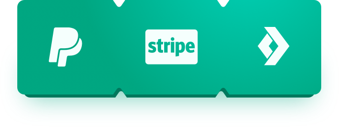

# Integración de pagos en Android
 


Ejemplo que contiene la implementación de [Stripe][stripe], [Conekta][conekta] y [PayPal][paypal] con [Clean Architecture][clean_architecture].

[clean_architecture]: https://8thlight.com/blog/uncle-bob/2012/08/13/the-clean-architecture.html
[stripe]: https://stripe.com/es
[conekta]: https://www.conekta.io/es
[paypal]: https://developer.paypal.com/

[Procesando pagos en Android - Primera parte](https://blog.inventivehack.com/procesando-pagos-en-android/)

[Procesando pagos en Android con Clean Architecture](https://blog.inventivehack.com/android-clean-architecture/)


## Arquitectura

Esta aplicación está construida con base a la definición The Clean Architecture del Robert C. Martin y en la implementación de Fernando Cejas para proyectos en Android.

Básicamente la idea es dividir nuestro proyecto en tres capas (presentación, dominio y datos), manteniendo una independencia de nuestra UI, lógica de negocia y acceso a nuestro modelo de datos, asegurándonos de que nuestro código sea flexible, mantenible y testable.

Para más información de Architecture, MVP y el Patrón Repositorio les recomiendo leer los siguientes artículos y posts.

 * [Uncle Bob - The Clean Architecture](https://blog.8thlight.com/uncle-bob/2012/08/13/the-clean-architecture.html)
 * [Karumi Team - Rosie is an Android framework to create applications following the principles of Clean Architecture](https://github.com/Karumi/Rosie)
 * [Fernando Cejas - Clean Architecture Sample](https://github.com/android10/Android-CleanArchitecture)
 * [Aplicando Clean Architecture en Android](http://erikcaffrey.github.io/2016/01/28/clean-architecture/)

## Bibliotecas y recursos usados en el proyecto
* [Android Support Library](https://developer.android.com/topic/libraries/support-library/index.html)
* [Android Design Support Library](https://developer.android.com/topic/libraries/support-library/index.html)
* [RxJava](https://github.com/ReactiveX/RxJava)
* [Butter Knife](http://jakewharton.github.io/butterknife/)
* [Retrofit](https://square.github.io/retrofit/)
* [Stripe_Android](https://github.com/stripe/stripe-android)
* [Conekta_Android](https://www.conekta.io/es/docs/referencias/conekta-android)
* [Paypal_Android](https://github.com/paypal/PayPal-Android-SDK)

## Desarrollador por

Edgar Salvador Maurilio Diego - [Github](https://github.com/salvadormaurilio/)

## Licencia

```
The MIT License (MIT)

Copyright (c) 2017 Inventive

Permission is hereby granted, free of charge, to any person obtaining a copy
of this software and associated documentation files (the "Software"), to deal
in the Software without restriction, including without limitation the rights
to use, copy, modify, merge, publish, distribute, sublicense, and/or sell
copies of the Software, and to permit persons to whom the Software is
furnished to do so, subject to the following conditions:

The above copyright notice and this permission notice shall be included in all
copies or substantial portions of the Software.

THE SOFTWARE IS PROVIDED "AS IS", WITHOUT WARRANTY OF ANY KIND, EXPRESS OR
IMPLIED, INCLUDING BUT NOT LIMITED TO THE WARRANTIES OF MERCHANTABILITY,
FITNESS FOR A PARTICULAR PURPOSE AND NONINFRINGEMENT. IN NO EVENT SHALL THE
AUTHORS OR COPYRIGHT HOLDERS BE LIABLE FOR ANY CLAIM, DAMAGES OR OTHER
LIABILITY, WHETHER IN AN ACTION OF CONTRACT, TORT OR OTHERWISE, ARISING FROM,
OUT OF OR IN CONNECTION WITH THE SOFTWARE OR THE USE OR OTHER DEALINGS IN THE
SOFTWARE.
```


